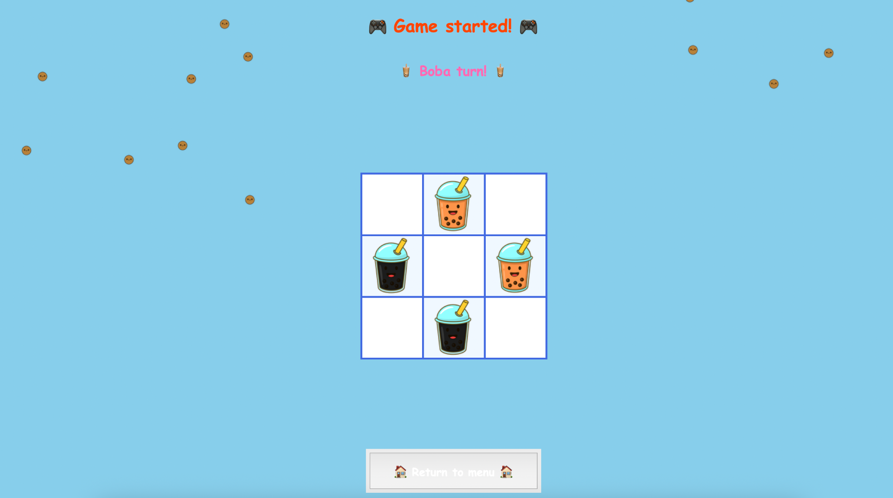

# Tic Tac Toe Boba



A fun and colorful Tic Tac Toe game with a boba tea theme, featuring animated pearls and retro background music.

## Learning Project

This project was created to enhance my Python programming skills and explore various concepts:

- **Object-Oriented Programming**: Structured code using classes and proper separation of concerns
- **GUI Development**: Built interactive interface using Tkinter with custom styling and animations  
- **Game Logic**: Implemented game rules, AI opponent, and win/tie detection algorithms
- **File Organization**: Modular code structure with clean imports and proper package management
- **Multimedia Integration**: Background music with pygame and animated sprites with PIL
- **Event Handling**: Mouse interactions, hover effects, and responsive UI elements

## Features

- **Two Game Modes**: Player vs Player and Player vs AI
- **Animated Background**: Falling boba pearls with transparency effects
- **Background Music**: Retro-style looping soundtrack
- **Interactive UI**: Hover effects and smooth animations
- **Cute Theme**: Boba tea inspired graphics and colors

## Requirements

Install the required dependencies:

```bash
pip install -r requirements.txt
